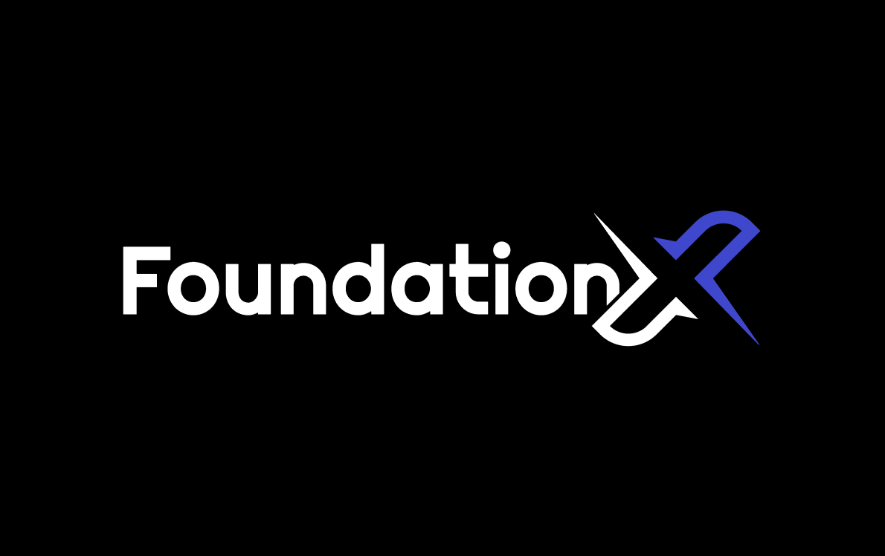

<!-- omit from toc -->
# FoundationX-API

Various Discord bots and related functionality for the [FoundationX](https://foundationxservers.com) server network.

## Table of Contents

- [Table of Contents](#table-of-contents)
- [Repository Structure](#repository-structure)
- [Installation](#installation)

## Repository Structure

This application consists of 2 main components, **modules** and **services**.

**Modules** are segments of functionality, they don't interact with each other and can be run in isolation from other modules. These include our main Discord bot (`mainBot`), server-stats-displaying Discord bots (`serverStatsBots`), and our front-facing web API (`webApi`).

**Services** are more specific portions of functionality. Similarly to modules, they do not interact with other services. However modules may interact with services. These include Discord OAuth and Steam linking (`TBD`), economy (`economy`), and server stats collection (`serverStats`).

## Installation

_TBD_

Main bot needs the following:
- scopes: `bot`, `applications.commands`
- permissions: `Manage Roles`, `Send Messages` `Embed Links` 
